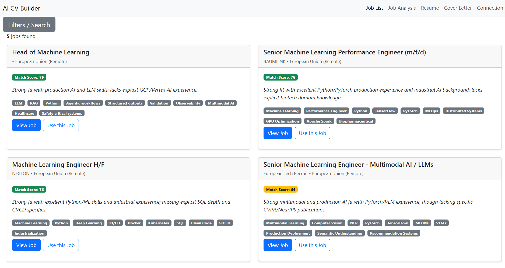
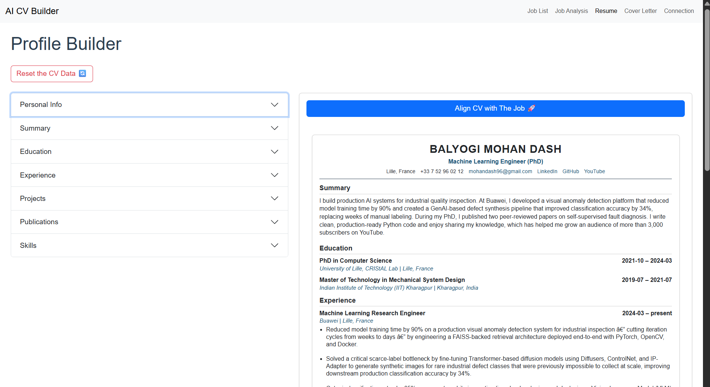
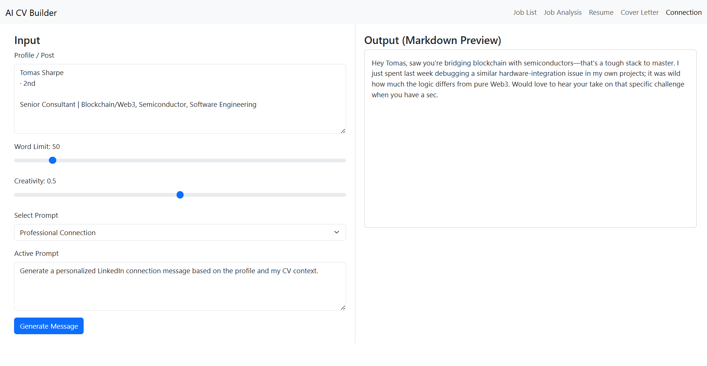
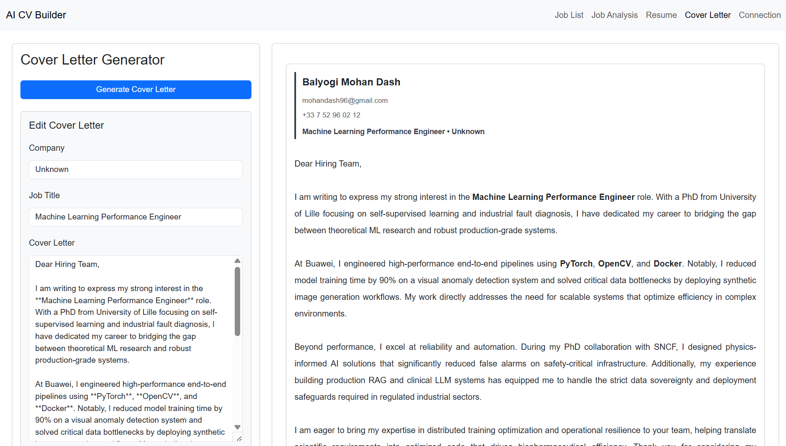
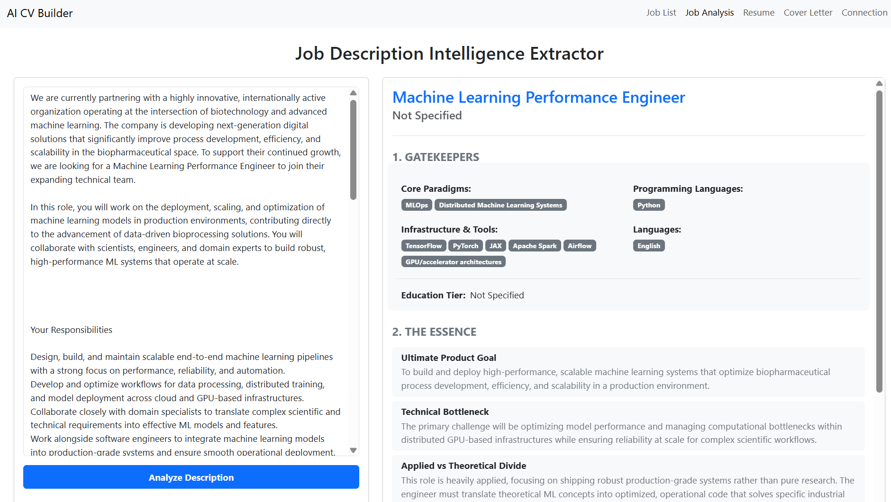

# AI CV Customization & Job Automation System 

<table>
  <tr>
    <td>
      
    </td>
    <td style="vertical-align: middle; padding-left: 20px;">
      <a href="https://youtu.be/1VJQv0_gJNE" target="_blank">
        ▶ Watch on YouTube
      </a>
    </td>
  </tr>
</table>

This project automates CV-based job searching and LinkedIn job interactions using:

- FastAPI backend
- React frontend (Bootstrap for styling)
- Playwright browser automation
- Local LLM support via Ollama (qwen3.5)

---

# Tech Stack

### Backend
- FastAPI (Python) – REST API framework for backend services  
- SQLite – Lightweight relational database  
- Playwright – Browser automation for LinkedIn job interactions  
- Pydantic – Data validation and schema management  

### Frontend
- React – Component-based UI development  
- Bootstrap – Responsive UI styling  
- Vite – Frontend build tool and dev server  

### AI / LLM Layer
- Ollama – Local LLM runtime  
- Qwen3.5 (various sizes) – Local inference model for text generation tasks  

### Infrastructure & Tooling
- UV – Python dependency and environment management  
- Node.js + npm – Frontend dependency management  
- Pytest – Backend testing framework

---

# Table of Contents

- [Feature Showcase](#feature-showcase)
- [Project Structure](#project-structure)
- [Architecture Diagram](#architecture-diagram)
- [Backend Setup](#backend-setup-instructions-for-sqlite-database-and-python-fastapi-backend)
- [Ollama Installation](#install-ollama-and-download-a-model)
- [Frontend Setup](#running-the-frontend-application)
- [Additional Information](#additional-information)

---

# Feature Showcase

### Job Listings View

<p align="center">
  
</p>

---

### Resume Builder

<p align="center">
  
</p>

---

### Connection Message Writer

<p align="center">
  
</p>

---

### Cover Letter Generator

<p align="center">
  
</p>

---

### Job Analysis Dashboard

<p align="center">
  
</p>

---

# Project Structure

```
AI_CV_Customization/
├── cv_editing_react_app/
│   ├── backend/              # Python Flask API
│   │   ├── api/              # API routes and endpoints
│   │   ├── config/           # Configuration files
│   │   ├── schema/           # Data validation schemas
│   │   ├── services/         # Business logic and services
│   │   ├── database/         # Database models and utilities
│   │   └── test/             # Backend tests
│   └── frontend/my-app/      # React frontend application
│       ├── src/              # React components and pages
│       ├── public/           # Static assets
│       └── package.json      # Node.js dependencies
├── job_listings/             # Job listings data
└── assets/                   # Project assets
```
The project is divided into two main directories:

- **backend/**: Contains the FastAPI backend code, including the database, API routes.
- **frontend/**: Contains the React frontend code, including the UI components and state management.
---

# Architecture Diagram

Even a simple text diagram helps:

```text
Frontend (React)
      ↓
FastAPI Backend
      ↓
Playwright Automation → LinkedIn
      ↓
Database (SQLite)
      ↓
Ollama (Local LLM)
```


# Backend Setup Instructions for SQLite Database and Python FastAPI Backend

## 1. Clone the Repository

```bash
git clone git@github.com:mohan696matlab/AI_CV_Customization.git
cd AI_CV_Customization
```

---

## 2. Install UV

If you do not already have `uv` installed:

```bash
pip install uv
```

Verify the installation:

```bash
uv --version
```

---

## 3. Install Project Dependencies

Install all Python dependencies and create the virtual environment:

```bash
uv sync
```

---

## 4. Install Playwright Browser Binaries

Playwright requires browser binaries for web automation. Install them with:

```bash
uv run playwright install
```

---

## 5. Configure Authentication

Create a `.env` file inside the `backend/` directory:

```text
backend/
└── .env
```

Add your LinkedIn credentials:

```ini
username=your_username
password=your_password
```

Example:

```ini
username=john.doe@gmail.com
password=my_password
```

---

## 6. Initialize the Database

Run the following command from the `backend/` directory:

```bash
uv run python -m services.database.db
```

---

## 7. Start the Backend Server

Launch the FastAPI server:

```bash
uv run uvicorn api.server:app --reload --port 8000
```

The API will be available at:

- **Application:** http://localhost:8000
- **Swagger UI:** http://localhost:8000/docs
- **ReDoc:** http://localhost:8000/redoc

---

# Install Ollama and Download a Model

Ollama allows you to run large language models locally on your machine.

---

## Download and Install Ollama

Go to the official website and install Ollama based on your operating system:

👉 https://ollama.com/download

### After installation, verify it works:

```bash
ollama --version
```

---

## Download a Model

To download (pull) a model, use:

```bash
ollama pull qwen3.5:9b # Other models qwen3.5:2b, qwen3.5:4b, qwen3.5:27b if you are in Mac then -mlx versions
```

---

## Edit the backend/config/local_llm_settings.py file

Update the `MODEL_NAME` and `HOST_ADDRESS` variables in the `local_llm_settings.py` file:

```python
MODEL_NAME = "qwen3.5:9b"

HOST_ADDRESS = "http://localhost:11434"
```

---

## Remove a Model (Optional)

```bash
ollama rm qwen3.5:9b
```

---

# Running the Frontend Application

## 1. Prerequisites: Install Node.js

Before starting, ensure Node.js and npm are installed:

```bash
node -v
npm -v
```

If these commands do not work, install Node.js from:

https://nodejs.org/en/download/

---

## 2. Navigate to the Frontend Directory

Move into the React application folder:

```bash
cd frontend/my-app
```

---

## 3. Install Dependencies (Reproducible Setup)

Install all dependencies exactly as defined in the lock file:

```bash
npm ci
```

---

## 4. Start the Development Server

Run the frontend in development mode:

```bash
npm run dev
```

# Running both Frontend and Backend using `npm run dev`  [Optional]

Must have this
```bash
npm install concurrently
```

Then run

```bash
npm run dev
```
> make sure you are inside the project root,  `AI_CV_Customization` directory when running this command. 

The frontend will be available at:
- **Application:** http://localhost:5173/

The backend will be available at:
- **Application:** http://localhost:8000
- **Swagger UI:** http://localhost:8000/docs
- **ReDoc:** http://localhost:8000/redoc

---

# Running Tests

To run the test suite:

```bash
uv run pytest -q
```

---

# Useful Commands

### Reinstall Project Dependencies

```bash
uv sync
```

### Update Dependencies

```bash
uv lock --upgrade
uv sync
```

### Install Playwright Browser Binaries

```bash

---

# Additional Information

## 1. Save LinkedIn Login Cookies (One-Time Setup)

This saves your LinkedIn login session so that you do not need to authenticate every time.

```bash
# Run only once
uv run python -m services.browser_automation_playwright.save_login_cookies
```

> **Note:** Make sure you are inside the `backend/` directory when running this command.

---

## 2. Scrape LinkedIn Job Listings (Optional)

To automatically scrape job listings from LinkedIn:

```bash
uv run python -m services.browser_automation_playwright.browser_automation
```

> **Note:** Make sure you are inside the `backend/` directory when running this command.

---

## 3. Run Tests

Execute the test suite with:

```bash
PYTHONPATH=. uv run pytest -q
```

---

## 4. Database Management

### Remove All Records (Keep Database)

Deletes all records while preserving the database schema and file.

```bash
uv run python -c "from services.database.db import delete_all_records; delete_all_records()"
```

### Completely Remove the Database

Deletes the database file entirely.

```bash
uv run python -c "from services.database.db import remove_db; remove_db()"
```

---

## 5. Useful Commands

### Reinstall Project Dependencies

```bash
uv sync
```

### Update Dependencies

```bash
uv lock --upgrade
uv sync
```

### Install Playwright Browser Binaries

```bash
uv run playwright install
```

### Start the Backend Server

```bash
uv run uvicorn api.server:app --reload --port 8000
```

### Run the Test Suite

```bash
PYTHONPATH=. uv run pytest -q
```

---
